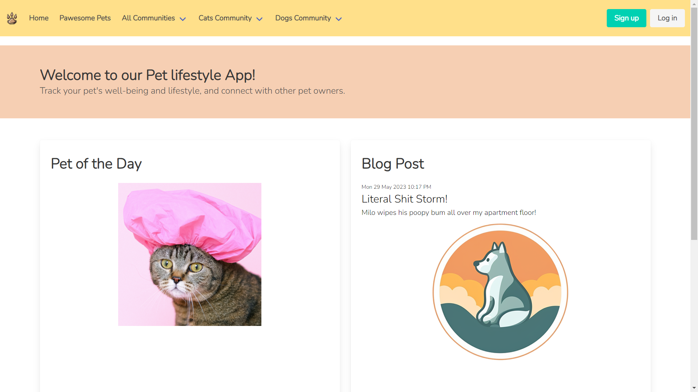
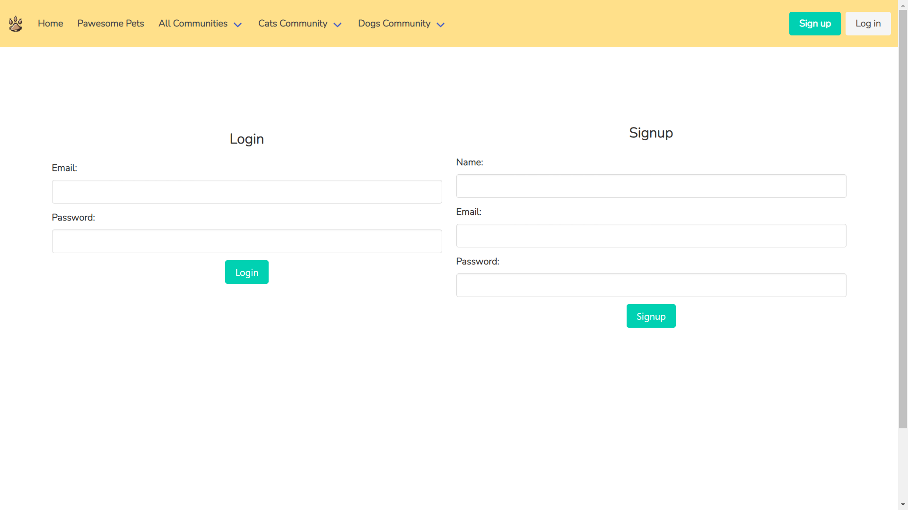
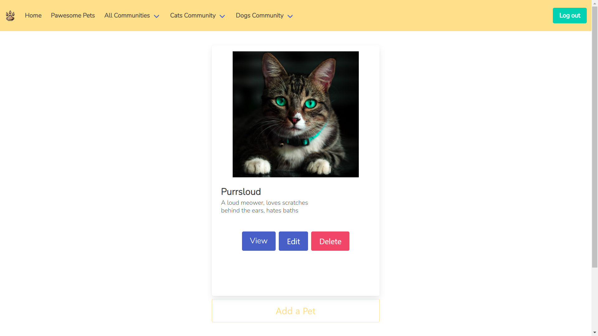
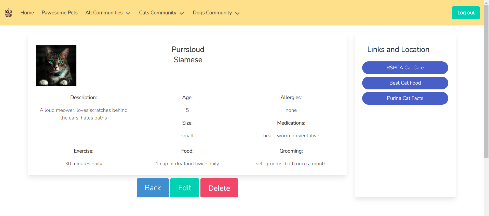
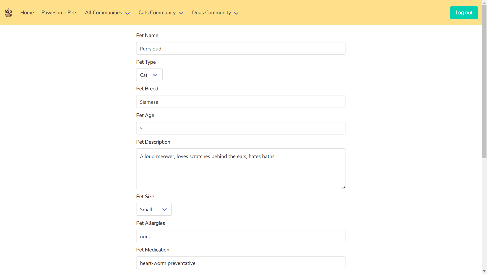
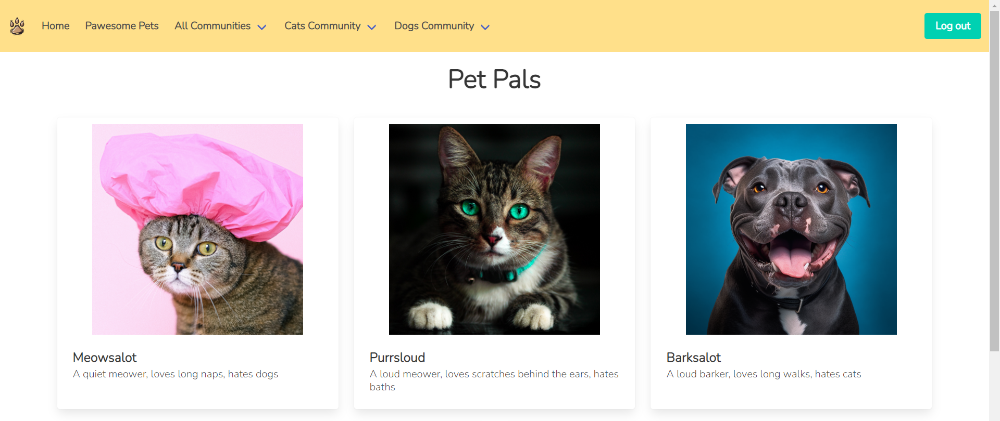
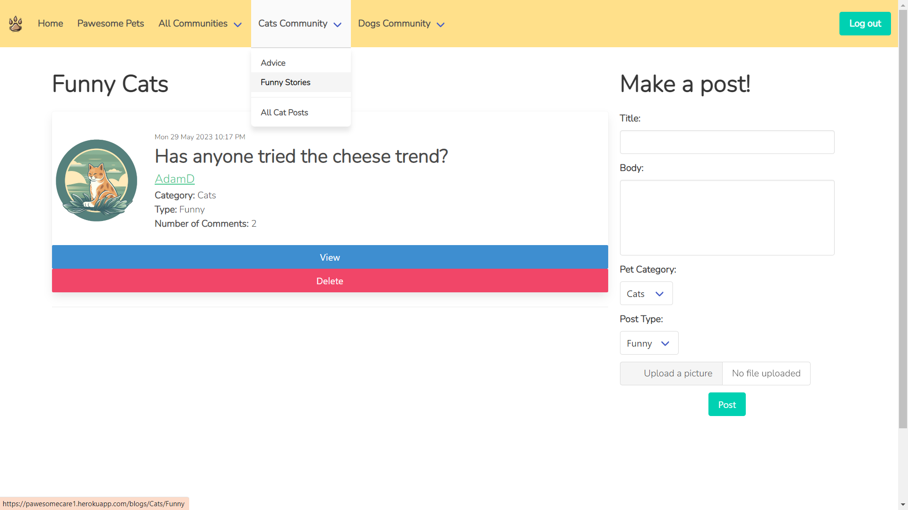
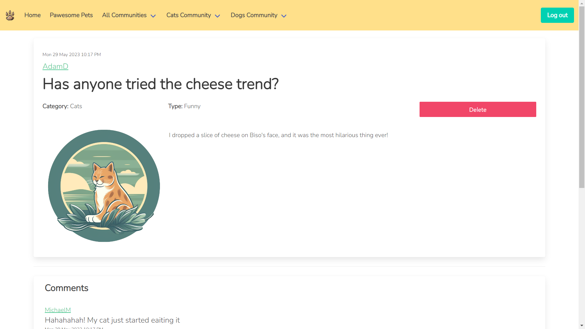
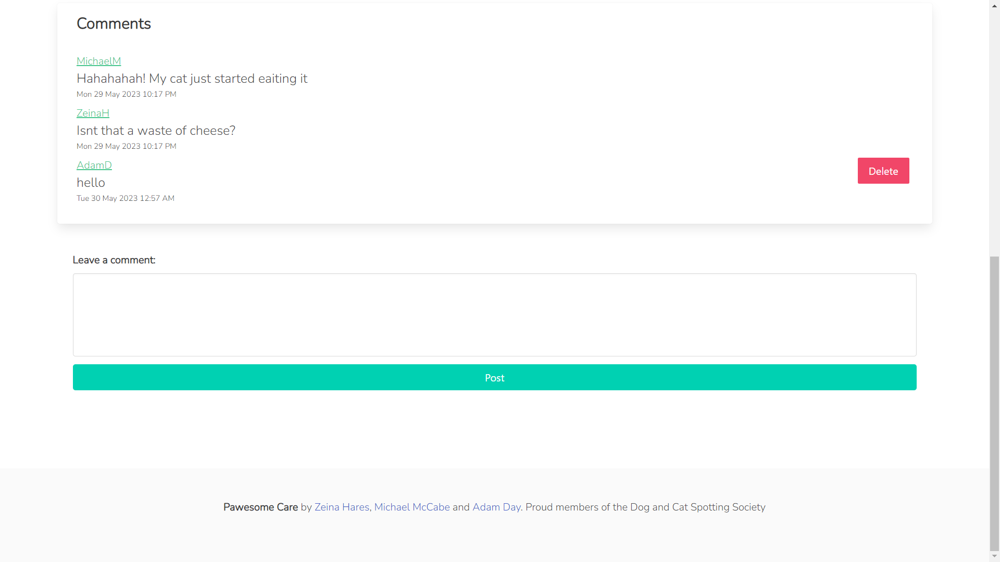

# Pawesome Care

## Link to Pawesome Care

https://pawesomecare1.herokuapp.com/

## Description
Pawesome Care is a web-application that allows pet owners to upload information about their pet-pals. It is designed with the idea of a ‘social media’ for your pets, a way to store information about your pet that is easily accessible, connect with other pet owners, and share stories and ideas with other users.

Our team are split fans of Cats and Dogs but we appreciate that all pet owners have a special spot for their pets. We wanted to create an application that targets this demographic of pet owners who want to keep track of their pets health, have a way to memorialise their pets online, and engage with other pets and pet owners.

Pawesome Care allows the user to easily create a profile for their pet. They should be able to provide basic information such as the pet's name, breed, age, and any specific details that they want to share or keep, including a short bio or description of the pet's personality and quirks. Once they create a profile, it is saved and accessible for future edits. Pet owners can also connect with other pet owners in their area or beyond, so that they can build a network of like-minded individuals and arrange playdates, share funny stories, and seek advice from their communities. They can share blog posts and photos, as well as comment on other people’s posts to connect and share ideas.

## Table of contents
- [Installation](#installation)
- [Usage](#usage)
- [License](#license)
- [Contribution](#contribution)
- [Tests](#tests)
- [Future Development](#future-development)

 

## Installation
N/A

## Usage
First thing, is sign up or create an account by clicking the login/sign up buttons. Then presented with a list of all (or none) of your pets. Press add a pet to create your pet lists. Fill out the relevant information (currently photo upload is not working) and click save. Now you can see your pet in your homepage, with the option to view, edit or delete. Press on view to see your pet's profile. You will see product recommendations selected to suit your specific pet's needs. Click on the Pawesome Pets to see and get to know all of our wonderful pets in the database. Click on any selection of community posts from the nav bar (funny cat blogs, or all posts). You can now see a list of the posts from your criteria, you can click on them to view, or make a post. If one of the posts is yours, you have the option to delete it from this page. If you click on a blog post, you can see all its contents and comments. You can now post a comment. If the comment or post is yours, you have the option to delete them from this page. 

## License
MIT License https://opensource.org/licenses/MIT

    Copyright (c) 2023 zeinahares adamday michaelmccabe
    
    Permission is hereby granted, free of charge, to any person obtaining a copy of this software and associated documentation files (the "Software"), to deal in the Software without restriction, including without limitation the rights to use, copy, modify, merge, publish, distribute, sublicense, and/or sell copies of the Software, and to permit persons to whom the Software is furnished to do so, subject to the following conditions:
    
    The above copyright notice and this permission notice shall be included in all copies or substantial portions of the Software.
    
    THE SOFTWARE IS PROVIDED "AS IS", WITHOUT WARRANTY OF ANY KIND, EXPRESS OR IMPLIED, INCLUDING BUT NOT LIMITED TO THE WARRANTIES OF MERCHANTABILITY, FITNESS FOR A PARTICULAR PURPOSE AND NONINFRINGEMENT. IN NO EVENT SHALL THE AUTHORS OR COPYRIGHT HOLDERS BE LIABLE FOR ANY CLAIM, DAMAGES OR OTHER LIABILITY, WHETHER IN AN ACTION OF CONTRACT, TORT OR OTHERWISE, ARISING FROM, OUT OF OR IN CONNECTION WITH THE SOFTWARE OR THE USE OR OTHER DEALINGS IN THE SOFTWARE.

## Contribution

Zeina Hares: https://github.com/zeinahares

Michael McCabe: https://github.com/Ekim1473

Adam Day: https://github.com/Sype7973

## Tests
N/A 

## Future Development

Upload Images, currently images are placeholder - utilise the mutler npm package to save file destinations for photo upload

Google maps to closest vets

Functionality to add pets and/or pet owners and email/message fellow owners with a click

Functionality to share your pet’s profile with your nominated pet sitter

Edit blog posts directly from the blog post

Phone Application development - Design is responsive to mobile but developments like: tracking dog walks by setting up google maps location services, tracking medicine and providing push notifications, tracking exercise routines and improvements, pages to connect with dog walkers, pet sitters, groomers, trainers, etc 

Navbar Burger Responsiveness for Mobile application
